# Gerador de nota fiscal

[](https://github.com/jorgekamezawa/case-nota-fiscal/actions/workflows/ci.yml)

Serviço que recebe um pedido em `POST /api/pedido/gerarNotaFiscal`, calcula o tributo de cada item e o frete, emite a nota fiscal e aciona quatro sistemas: registro, estoque, entrega e financeiro.

**O problema.** O serviço chegou ao time com defeitos que já atingiam os consumidores: itens de um pedido apareciam na nota de outro (risco de LGPD), notas saíam com valores errados ou sem itens e eram respondidas como sucesso, e o tempo de resposta subia de 1,5 s para 6,5 s até a aplicação ser reiniciada. Tudo isso numa versão do Spring Boot sem suporte, sem log, métrica nem testes confiáveis.

**A abordagem.** Em vez de reescrever do zero ou só apagar incêndio, o time primeiro executou e diagnosticou o código original, levou as dúvidas de regra ao PO e registrou o plano numa RFC com 7 fases e 14 ADRs. Cada fase é entregue num PR próprio, guiada por spec (SDD) e com cada requisito rastreado até o teste. Primeiro o que atinge o consumidor; depois modernizar, isolar as regras e instrumentar; só então a mudança de maior risco.

## Estado atual

As fases 1 a 4 estão concluídas e na `main`; as fases 5 a 7 estão planejadas e decididas na RFC e nos ADRs.

| Fase | Objetivo | Status | Spec | PR |
|---|---|---|---|---|
| 1. Correções imediatas | Nota correta ou recusa clara | Concluída | [E-01](docs/04-specs/e-01-nota-correta/spec.md) | [#1](https://github.com/jorgekamezawa/case-nota-fiscal/pull/1) |
| 2. Modernização | Java 21 e Spring Boot 4.1 sem mudar comportamento | Concluída | [F-02](docs/04-specs/f-02-modernizacao/spec.md) | [#2](https://github.com/jorgekamezawa/case-nota-fiscal/pull/2) |
| 3. Arquitetura | Hexagonal: regra nova é código novo | Concluída | [F-03](docs/04-specs/f-03-arquitetura/spec.md) | [#3](https://github.com/jorgekamezawa/case-nota-fiscal/pull/3) |
| 4. Observabilidade | Logs, métricas, traces e alertas | Concluída | [F-04](docs/04-specs/f-04-observabilidade/spec.md) | [#4](https://github.com/jorgekamezawa/case-nota-fiscal/pull/4) |
| 5. Confiabilidade | Resposta sem esperar as integrações; nada perdido nem duplicado | Planejada | [RFC 6.2](docs/03-engenharia/rfc/0001-modernizacao-gerador-nota-fiscal.md#62-consistência-e-integrações), ADRs 0012 a 0014 | |
| 6. Segurança | Só sistemas autorizados emitem nota | Planejada | ADRs 0005 e 0006 | |
| 7. Entrega | Pipeline completo, Terraform e deploy canary na AWS | Planejada | ADRs 0008 e 0010 | |

**O que já funciona**
- Cada pedido isolado: nenhum dado de outro pedido na nota, inclusive com 150 chamadas simultâneas (D-01, D-03).
- Valores em decimal exato, arredondamento pela NBR 5891 e tributo por quantidade × valor unitário.
- Entrada inválida recusada com 400 em Problem Details, com o motivo de cada campo ([catálogo de erros](docs/api/erros.md)).
- Contrato de entrada e resposta de sucesso inalterados, garantidos por teste de contrato e por respostas de referência gravadas antes do upgrade.
- Java 21, Spring Boot 4.1, arquitetura hexagonal conferida no build por ArchUnit.
- Observabilidade com OpenTelemetry: log em JSON ligado ao trace, métricas de negócio, dashboard e alertas de SLO, sem dado pessoal na telemetria.
- 213 testes, em ordem aleatória a cada execução, no CI de todo PR.

**O que ainda falta**
- **Fase 5:** a resposta ainda espera as quatro integrações (cerca de 1,3 s; cerca de 6,4 s com 6 linhas de item ou mais) e não há persistência: queda no meio do processamento e reenvio do mesmo pedido ainda não são tratados (D-05, D-07, D-08).
- **Fase 6:** a API não exige autenticação.
- **Fase 7:** o CI roda build e testes, mas ainda não há quality gate, imagem, infraestrutura em código nem deploy.

## Rodar localmente

**Pré-requisitos:** Java 21 (pelo [sdkman](https://sdkman.io/): `sdk env install` usa a versão do `.sdkmanrc`) e Docker.

```bash
# testes (213, em ordem aleatória)
./mvnw -B clean verify

# Grafana local com coletor, Prometheus, Loki e Tempo: http://localhost:3000
docker compose up -d

# aplicação com log em texto e telemetria enviada ao Grafana local
./mvnw spring-boot:run -Dspring-boot.run.profiles=local

# um pedido de exemplo
curl -s -H 'Content-Type: application/json' \
  -d @src/test/resources/payloads/teste-pf.json \
  http://localhost:8080/api/pedido/gerarNotaFiscal
```

**Onde ver o resultado**
- **Saúde:** http://localhost:8080/actuator/health/readiness.
- **Dashboard:** no Grafana, "Gerador de nota fiscal": requisições, latência p95 e p99, notas emitidas, recusas por motivo e duração de cada integração.
- **Do log ao trace:** em Explore, rode no Loki `{service_name="gerador-nota-fiscal"}` e clique no `trace_id` de uma linha para abrir no Tempo o caminho da requisição, com um trecho por integração.
- **Alertas:** em Alerting, os 6 alertas de SLO. O de latência p95 dispara até a fase 5, como previsto.

Para desligar: `docker compose down` (sem `-v`).

## Como a aplicação foi analisada

Antes de propor qualquer mudança, o time executou o código original e mediu o comportamento real.

- **[Testes manuais com evidências](docs/01-levantamento/evidencias-testes-manuais.md):** 12 cenários com requisição e resposta reais, como itens acumulando entre chamadas, tempo de resposta subindo, nota sem itens para pessoa jurídica, frete zerado sem endereço de entrega, erro 500 genérico e itens perdidos sob concorrência.
- **[Diagnóstico técnico](docs/01-levantamento/diagnostico-tecnico.md):** 18 defeitos (D-01 a D-18), cada um com causa, evidência e impacto, classificados em 4 críticos, 9 altos, 2 médios e 3 baixos. Separa o que a demanda já informava do que a análise encontrou, como a condição de corrida, a falha parcial sem tratamento, a falta de idempotência e os valores em `double`.
- **[Levantamento de regras de negócio](docs/01-levantamento/levantamento-regras-negocio.md):** as regras vigentes extraídas do código e 13 perguntas ao PO (Q-01 a Q-13), como "o total declarado deve ser conferido?", "o tributo é por unidade ou pelo total do item?", "o que fazer quando o mesmo pedido chega de novo?" e "por quanto tempo guardar as notas?". Cada resposta registra a decisão e o efeito nos consumidores.

## Como foi planejado

- **[RFC-0001](docs/03-engenharia/rfc/0001-modernizacao-gerador-nota-fiscal.md):** o documento central. Problema, causa e três caminhos avaliados (só corrigir, reescrever, evoluir em fases); objetivos com critério de prova; premissas e restrições; arquitetura da aplicação e da AWS; dados pessoais (LGPD); SLOs; custo estimado; roadmap em 7 fases com o motivo da ordem; riscos e perguntas técnicas em aberto.
- **[14 ADRs](docs/03-engenharia/adr/):** uma decisão por documento, com o contexto, as alternativas descartadas e o porquê, e as consequências (ganhos, custos e o que passa a ser obrigatório).

  | ADR | Decisão |
  |---|---|
  | 0001 | Java 21 e Spring Boot com maior suporte |
  | 0002 | Virtual threads para esperas de I/O |
  | 0003 | Arquitetura hexagonal enxuta |
  | 0004 | ECS Fargate |
  | 0005 | Autenticação OAuth2 client credentials |
  | 0006 | Borda com API Gateway REST |
  | 0007 | Observabilidade com OpenTelemetry |
  | 0008 | Deploy canary com rollback automático |
  | 0009 | Erros no formato Problem Details |
  | 0010 | Infraestrutura com Terraform |
  | 0011 | Telemetria no Grafana Cloud |
  | 0012 | Persistência em DynamoDB |
  | 0013 | Acionamento das integrações por outbox com Streams e SQS |
  | 0014 | Reenvio reconhecido por `id_pedido` e hash |

- **[Spike-0001](docs/03-engenharia/spikes/0001-persistencia-e-acionamento-das-integracoes.md):** onde guardar as notas e como garantir o acionamento dos quatro sistemas, com o caminho completo de um pedido e cada falha coberta.
- **[Épico](docs/02-produto/epico-nota-fiscal-confiavel.md):** as decisões do PO viram cinco entregáveis de negócio (E-01 nota correta ou recusa clara, E-02 resposta sem esperar os sistemas, E-03 reenvio devolve a mesma nota, E-04 guarda por 5 anos, E-05 só sistemas autorizados); as fases 2, 3, 4 e 7 são habilitadores técnicos.
- **Arquitetura AWS:**

  

## Como é executado: desenvolvimento guiado por spec (SDD)

```mermaid
flowchart LR
    D[Demanda] --> L[Diagnóstico e levantamento]
    L --> PO{{PO decide as regras}}
    PO --> R[RFC e ADRs]
    R --> E[Épico]
    E --> S[Spec da fase]
    S --> T[Tasks por camada]
    T --> C[Código e testes]
    C --> Q[QA de rastreabilidade]
    Q --> PR[PR com evidências e CI]
```



- **Spec** (`docs/04-specs/<entregável>/spec.md`): o que entregar, sem tecnologia. A parte funcional é do PO (regras com ID, como `E01-RN-07`, e exemplos); a não funcional é do time (requisitos como `F04-NF-05`, com a origem de cada um). Toda dependência nova é listada e aprovada ali.
- **Tasks** (`tasks.md`): como implementar, por camada, citando classes e pacotes e o ID da regra que cada uma cobre, sem código. A última task é sempre de QA.
- **Código:** uma branch e um PR por fase, commits agrupados por entrega. Todo defeito ganha primeiro o teste que o reproduz; o nome de cada teste cita o requisito que cobre.
- **QA:** a última task confere se cada requisito da spec tem teste ou evidência, se nenhum teste antigo foi enfraquecido e se as esperas simuladas continuam intactas.
- **Garantias entre fases:** teste de contrato criado na fase 1, antes de qualquer upgrade; respostas de referência gravadas antes da migração de versão; regras de arquitetura conferidas no build.

## Como o time usa IA e agentes

A IA acelera análise, escrita e implementação; as decisões continuam com pessoas.

- **Claude Code como par de desenvolvimento:** executou os testes manuais, levantou o diagnóstico, escreveu rascunhos de documentos e implementou as tasks. Todo documento é revisado em blocos antes de ser gravado; toda dependência nova, commit e push passam por aprovação.
- **Regras que a IA segue** ([`CLAUDE.md`](CLAUDE.md) e [`src/CLAUDE.md`](src/CLAUDE.md)): convenções do projeto e requisitos transversais carregados em toda sessão, como log sem dado pessoal, arquitetura hexagonal, nome do teste com o ID do requisito e dependência só com aprovação. Evitam repetir as mesmas regras em cada spec.
- **Agente de PO** ([`.claude/agents/product-owner.md`](.claude/agents/product-owner.md)): responde às perguntas de negócio do levantamento com critérios explícitos, nesta ordem: obrigação legal e fiscal, risco para cliente e banco, impacto nos consumidores e valor. Forma a opinião antes de ler a recomendação da engenharia e não decide tecnologia. O time valida e debate cada resposta antes de registrá-la.
- **Revisores de contexto limpo:** agentes sem o histórico da conversa, só com leitura. Ao fim de cada documento, conferem a coerência com RFC, ADRs, código e convenções; na QA de cada fase, a rastreabilidade. Os achados voltam com uma recomendação e o time decide o que aplicar. Exemplo real da fase 4: o revisor encontrou um CPF que escapava da máscara numa exceção anexada a outra e um ciclo de causas que derrubava o log; os dois viraram teste antes da correção.
- **Fontes primárias:** versões e comportamento das bibliotecas conferidos no Maven Central e no código-fonte (por exemplo, a versão do appender de logs compatível com o SDK que o Boot traz), não em suposição.

## Guia de leitura

**Por onde começar, conforme o objetivo**
- **Visão geral:** este README, o [resumo da RFC](docs/03-engenharia/rfc/0001-modernizacao-gerador-nota-fiscal.md#1-resumo-executivo) e o diagrama AWS.
- **Problema e regras:** [demanda](docs/00-demanda/demanda.md), [evidências](docs/01-levantamento/evidencias-testes-manuais.md), [diagnóstico](docs/01-levantamento/diagnostico-tecnico.md) e [levantamento](docs/01-levantamento/levantamento-regras-negocio.md).
- **Arquitetura e decisões:** RFC seções 6 e 7, os ADRs e o spike.
- **Como uma fase sai do papel:** [spec](docs/04-specs/f-04-observabilidade/spec.md) e [tasks](docs/04-specs/f-04-observabilidade/tasks.md) da fase 4 e o [PR #4](https://github.com/jorgekamezawa/case-nota-fiscal/pull/4), com commits, evidências e revisão.

**Mapa**

| Caminho | Conteúdo |
|---|---|
| `docs/00-demanda` | Escopo e restrições recebidos |
| `docs/01-levantamento` | Evidências, diagnóstico e regras com as decisões do PO |
| `docs/02-produto` | Épico e entregáveis de negócio |
| `docs/03-engenharia` | RFC, ADRs, spike e diagramas |
| `docs/04-specs` | Spec e tasks de cada fase |
| `docs/api` | Catálogo de erros da API |
| `observabilidade/grafana` | Dashboard e alertas, os mesmos no local e na nuvem |
| `CLAUDE.md`, `src/CLAUDE.md` | Convenções do projeto |
| `.claude/agents` | Agente de PO |
