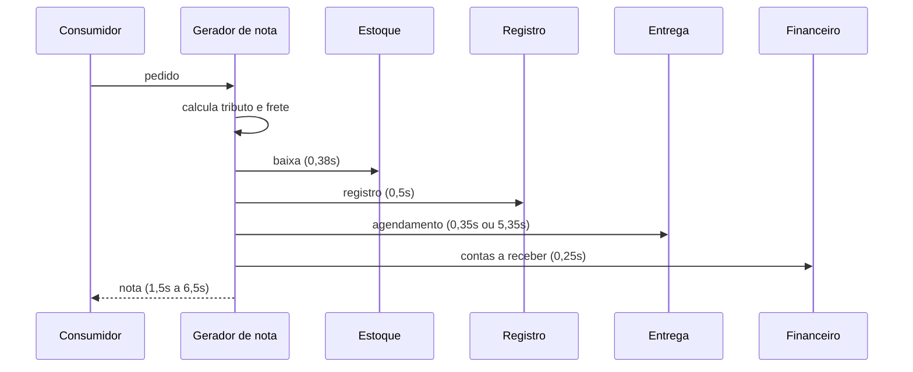
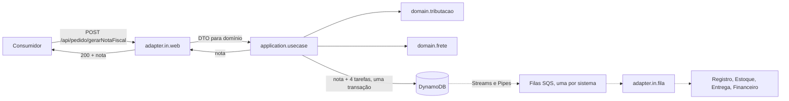
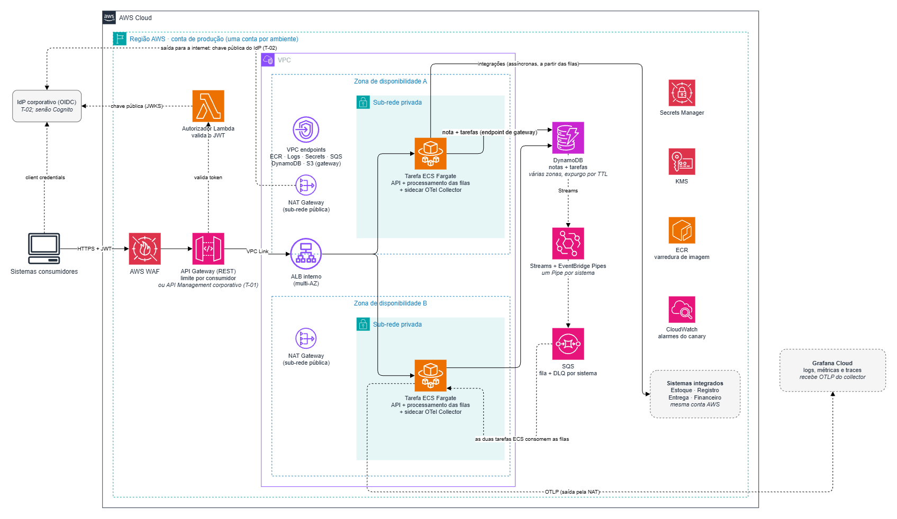

# RFC-0001: Modernização do gerador de nota fiscal

| | |
|---|---|
| **Autor** | Jorge Kamezawa |
| **Status** | Aprovada; fases 1 a 5 implementadas |
| **Revisores** | Tech Lead, Arquitetura, Segurança da Informação, Plataforma / SRE |
| **Aprovadores** | Tech Lead e Arquitetura |
| **Condições da aprovação** | Cada fase entregue num PR próprio, com build e testes verdes; as fases 6 e 7 começam após as respostas das perguntas T-01 e T-02 (seção 9) |
| **Regras de negócio** | [Levantamento de regras de negócio](../../01-levantamento/levantamento-regras-negocio.md) |
| **Diagnóstico detalhado** | [Diagnóstico técnico](../../01-levantamento/diagnostico-tecnico.md) |
| **Demanda** | [demanda.md](../../00-demanda/demanda.md) |
| **ADRs** | [0001 Java e Spring Boot](../adr/0001-java-21-e-spring-boot-com-maior-suporte.md) · [0002 Virtual threads](../adr/0002-virtual-threads-para-esperas-de-io.md) · [0003 Hexagonal](../adr/0003-arquitetura-hexagonal-enxuta.md) · [0004 ECS Fargate](../adr/0004-computacao-em-ecs-fargate.md) · [0005 Autenticação](../adr/0005-autenticacao-oauth2-client-credentials.md) · [0006 Borda](../adr/0006-borda-com-api-gateway-rest.md) · [0007 Observabilidade](../adr/0007-observabilidade-com-opentelemetry.md) · [0008 Deploy](../adr/0008-deploy-canary-com-rollback-automatico.md) · [0009 Erros](../adr/0009-erros-no-formato-problem-details.md) · [0010 Terraform](../adr/0010-infraestrutura-com-terraform.md) · [0011 Grafana Cloud](../adr/0011-telemetria-no-grafana-cloud.md) · [0012 DynamoDB](../adr/0012-persistencia-em-dynamodb.md) · [0013 Outbox](../adr/0013-acionamento-por-outbox-com-streams-e-sqs.md) · [0014 Reenvio](../adr/0014-reenvio-por-id-pedido-e-hash.md) |
| **Spikes** | [0001 Persistência e acionamento das integrações](../spikes/0001-persistencia-e-acionamento-das-integracoes.md) |

## 1. Resumo executivo

**Problema.** O gerador de notas fiscais tem defeitos que já atingem os consumidores:
- **Dados de um pedido aparecem na nota de outro:** os itens se acumulam entre requisições, com risco de LGPD.
- **Notas saem com valores errados ou sem itens,** e mesmo assim são respondidas como sucesso.
- **O tempo de resposta sobe de 1,5 s para 6,5 s** depois de poucas execuções e só volta ao normal reiniciando.
- **Nada disso é visível para o time:** não há logs, métricas nem alertas, e a suíte de testes está quebrada.

**Causa.** Estado compartilhado entre requisições, regras concentradas numa única classe, integrações executadas em série antes da resposta e ausência de validação da entrada, sobre uma versão do Spring Boot sem suporte desde 2022 (seção 3).

**Caminhos avaliados.**
- **Só corrigir os defeitos críticos e parar:** o mais rápido, mas mantém a versão sem suporte, a falta de visibilidade e a classe que muda a cada regra; o próximo defeito seria descoberto pelos consumidores de novo.
- **Reescrever do zero:** permite o desenho ideal, mas congela as correções urgentes até o fim e troca defeitos conhecidos por desconhecidos num serviço fiscal.
- **Escolhido, evolução em 7 fases** (seção 7): corrige primeiro o que atinge os consumidores, na versão atual, e depois moderniza, isola as regras, instrumenta, torna confiável, protege e automatiza a entrega, cada fase entregue e validada separadamente.

**Principais decisões.** ECS Fargate com deploy canary e rollback automático; autenticação OAuth2 validada na borda e no serviço; observabilidade em OpenTelemetry; DynamoDB, com acionamento das integrações por outbox e filas SQS. Cada decisão tem um ADR com as alternativas descartadas.

**O que foi aprovado.**
- A direção geral, os ADRs e as **fases 1 a 7**; as fases 1 a 5 estão implementadas, e as fases 6 e 7 seguem planejadas (seção 7).
- Segurança da Informação, DPO e Fiscal acionados sobre os riscos 1 e 2 (seção 8).

## 2. Contexto

**O que o serviço faz.** Recebe um pedido em `POST /api/pedido/gerarNotaFiscal`, calcula o tributo de cada item e o frete, emite a nota fiscal e aciona quatro sistemas: estoque, registro, entrega e financeiro. As regras vigentes estão no [levantamento](../../01-levantamento/levantamento-regras-negocio.md).

**Quem consome.** Outros sistemas (P-02), que enviam o pedido e usam a nota devolvida.

**Como funciona hoje.**

**Estado técnico.** Java 11 e Spring Boot 2.6.2, sem banco de dados, sem log, métrica ou health check, com a suíte de testes quebrada.

**Decisões de negócio que moldam o desenho.** Respostas do PO no [levantamento](../../01-levantamento/levantamento-regras-negocio.md).
| Decisão | Efeito no desenho |
|---|---|
| Q-01 a Q-08: validação, cálculo e arredondamento | Fase 1 |
| Q-09 e Q-12: reenvio devolve a mesma nota enquanto guardada | [ADR-0014](../adr/0014-reenvio-por-id-pedido-e-hash.md) |
| Q-10 e Q-11: resposta após gravar; os quatro sistemas acionados depois, com nova tentativa e alerta | [ADR-0013](../adr/0013-acionamento-por-outbox-com-streams-e-sqs.md) |
| Q-13: guarda por 5 anos neste serviço | [ADR-0012](../adr/0012-persistencia-em-dynamodb.md) |

O Registro é um sistema externo, não a persistência do serviço, e é acionado depois da resposta, como os outros três.

## 3. Diagnóstico

Resumo dos defeitos. Causa, evidência e impacto de cada um estão no [diagnóstico técnico](../../01-levantamento/diagnostico-tecnico.md), obtido executando o código original. **Informado** = listado na demanda; **Identificado** = encontrado na análise.

| ID | Defeito | Origem | Impacto |
|---|---|---|---|
| **Crítica** | | | |
| D-01 | Itens acumulados entre requisições | Informado | Nota com itens de outros pedidos; dados de um cliente expostos a outro (LGPD) |
| D-02 | Latência crescente após execuções sucessivas | Informado | De 1,5 s para 6,5 s para todos, até reiniciar |
| D-03 | Condição de corrida na lista compartilhada | Identificado | Perda silenciosa de 2% a 22% dos itens sob concorrência |
| D-04 | PJ sem regra de tributação gera nota sem itens (Q-02) | Identificado | Documento fiscal vazio aceito como sucesso |
| **Alta** | | | |
| D-05 | Integrações sequenciais | Informado | Latência é a soma das integrações; cada requisição prende uma thread durante as esperas |
| D-06 | Suíte de testes quebrada e dependente de ordem | Informado | Nenhuma proteção contra regressão |
| D-07 | Falha parcial sem tratamento | Identificado | Estoque baixado sem nota registrada |
| D-08 | Sem idempotência | Identificado | Reenvio duplica a nota e os acionamentos |
| D-09 | Total declarado não é conferido (Q-01) | Identificado | Tributo calculado a partir de dado controlado pelo cliente |
| D-10 | Entrada sem validação (Q-07) | Identificado | Erro do cliente vira 500; dado inválido vira nota |
| D-11 | Frete inconsistente sem endereço de entrega (Q-05) | Identificado | Frete perdido em silêncio, ou erro 500 |
| D-12 | Valores monetários em `double` (Q-08) | Identificado | Valores sem padrão e diferenças de centavos |
| D-13 | Sem observabilidade | Identificado | Problemas só percebidos pelos consumidores |
| **Média** | | | |
| D-14 | Alta complexidade e concentração de responsabilidades | Informado | Toda regra nova altera a mesma classe |
| D-15 | Spring Boot fora de suporte | Identificado | Sem correções de segurança no framework |
| **Baixa** | | | |
| D-16 | Campos do endereço descartados na resposta | Identificado | Dado de entrada perdido; não quebra contrato |
| D-17 | Data da nota sem fuso horário | Identificado | Horário ambíguo para os consumidores |
| D-18 | Menores (injeção por campo, `new` nas integrações, nomes) | Identificado | Dificulta testar e manter |

**Mudança de regra decidida (Q-03):** o tributo passa a incidir sobre quantidade × valor unitário, na fase 1, com aviso aos consumidores.

## 4. Objetivos, critérios de sucesso e escopo

### 4.1 Objetivos e como provar

Cada critério é provado com evidência reproduzível (comando e saída real). Os planos de teste detalhados ficam nas specs de cada fase.

| Objetivo | Critério de sucesso | Como provar |
|---|---|---|
| **O-01. Defeitos corrigidos** (D-01 a D-13 e D-16 a D-18) | Todo defeito com comportamento reproduzível tem teste que falhava antes e passa depois (D-06 se prova pela suíte verde; D-13 pela instrumentação). Com 150 chamadas simultâneas, cada resposta traz só os itens do próprio pedido, sem perda. | Teste vermelho antes do conserto; testes manuais e de concorrência do diagnóstico reexecutados |
| **O-02. Latência independente do pedido** | p95 < 800 ms com 1 linha de item e com 6 ou mais (hoje 1,5 s a 6,5 s); a espera simulada da entrega continua em cerca de 5,35 s, fora da resposta | Teste de carga local, cada cenário rodado duas vezes nas mesmas condições; tempos no trace |
| **O-03. Nada perdido nem duplicado** | Queda da aplicação no meio do processamento não perde integração; reenvio devolve a mesma nota sem acionar os sistemas de novo | Testes de integração que interrompem o processamento e reenviam o pedido |
| **O-04. Fácil de evoluir** | Regra de tributação nova é código novo, sem alterar as existentes; testes unitários sem as esperas simuladas | PR de exemplo com uma regra fictícia |
| **O-05. Modernização** | Java 21 e Spring Boot 4.1 com teste de contrato verde antes e depois ([ADR-0001](../adr/0001-java-21-e-spring-boot-com-maior-suporte.md)) | Pipeline da fase 2 |
| **O-06. Pronto para produção** | Falha simulada (entrega fora do ar) aparece em alerta; nota seguida do log ao trace; pipeline com quality gate e `terraform validate` verdes | Execução local e do pipeline |
| **O-07. Compatibilidade de contrato** | Entrada idêntica; sucesso continua 200 com os mesmos campos; entrada inválida passa a 400, reenvio com conteúdo diferente a 422 e banco indisponível a 503, no formato do [ADR-0009](../adr/0009-erros-no-formato-problem-details.md) | Teste de contrato em todas as fases |

### 4.2 Fora do escopo

- **Regras de negócio:** seguem as decisões do PO no levantamento; esta RFC não define regra.
- **Sistemas externos reais:** estoque, registro, entrega e financeiro continuam simulados, com as mesmas esperas.
- **Emissão fiscal oficial:** XML da NF-e e integração com a SEFAZ.
- **Produção real:** o deploy contínuo para produção é descrito, sem execução; a infraestrutura é validada num ambiente de demonstração efêmero (fase 7).
- **Nova versão da API** (`/v2`) e **multi-região**.

## 5. Premissas e restrições

### 5.1 Restrições (definidas pela demanda)
- **R-01.** Contrato de entrada imutável: mesmo endpoint, campos e formato (`snake_case`).
- **R-02.** Esperas simuladas mantidas, incluindo a regra de 6 linhas de item ou mais na entrega.
- **R-03.** Java 21 e Spring Boot estável mais recente, com cada recurso novo justificado.
- **R-04.** Resposta de sucesso compatível: 200 e os mesmos campos.

### 5.2 Premissas
- **P-01.** `id_pedido` é único no geral e nunca reutilizado (confirmado na Q-09).
- **P-02.** Os consumidores são sistemas (demanda: "sistemas consumidores"); se internos ou externos, não foi informado.
- **P-03.** O ambiente de produção é AWS (demanda).
- **P-04.** O volume não foi informado; o dimensionamento é revisado com dados de produção (T-04).
- **P-05.** Estoque, registro, entrega e financeiro estão na mesma conta AWS e têm contratos de API definidos.

## 6. Arquitetura proposta

### 6.1 Aplicação

**Estilo:** hexagonal enxuta, com domínio, aplicação e adaptadores separados por pacotes ([ADR-0003](../adr/0003-arquitetura-hexagonal-enxuta.md), com a estrutura de pacotes). O domínio não conhece HTTP, banco nem integrações.

**Intenção de design.**
- Cada regra de tributação isolada por tipo de pessoa e regime: regra nova não altera as existentes (O-04).
- Valores monetários exatos, com uma política única de arredondamento conforme a decisão do negócio (Q-08).
- Domínio imutável e nenhum estado compartilhado entre requisições, o que elimina a classe de defeito de D-01 e D-03.

**Fluxo de uma requisição** (detalhes na seção 6.2).

**Recursos do Java 21 e o benefício de cada um.**
- **Records:** DTOs e domínio imutáveis, sem estado compartilhado (D-01, D-03).
- **Switch com pattern matching:** a escolha da regra por tipo de pessoa e regime é exaustiva; o compilador acusa caso novo sem tratamento (D-04).
- **Virtual threads:** esperas de I/O não prendem threads do servidor (D-05, [ADR-0002](../adr/0002-virtual-threads-para-esperas-de-io.md)).

### 6.2 Consistência e integrações

A resposta ao consumidor depende só da gravação no DynamoDB ([ADR-0012](../adr/0012-persistencia-em-dynamodb.md)). Registro, estoque, entrega e financeiro são acionados depois, por outbox e filas ([ADR-0013](../adr/0013-acionamento-por-outbox-com-streams-e-sqs.md)), e o reenvio é reconhecido pelo `id_pedido` e por um hash do conteúdo ([ADR-0014](../adr/0014-reenvio-por-id-pedido-e-hash.md)). Tabelas, caminho de um pedido e cada falha coberta estão no [Spike-0001](../spikes/0001-persistencia-e-acionamento-das-integracoes.md).

**Caminho de um pedido**
1. O serviço valida, calcula e grava numa transação a nota e 4 tarefas pendentes, só se o `id_pedido` ainda não existir.
2. Responde 200 com a nota.
3. O Streams e os Pipes levam cada tarefa à fila do seu sistema; o processo em segundo plano pega a tarefa uma única vez, chama o sistema e marca a tarefa como concluída.
4. Falha gera nova tentativa a cada 2 minutos; na 5ª, o serviço marca a tarefa como FALHOU, move a mensagem para a fila de erro (DLQ) e a operação é alertada.
5. Uma reconciliação a cada poucos minutos recoloca na fila tarefas paradas há mais de 15 minutos.

**Dados pessoais (LGPD)**
| Onde | Dado pessoal | Proteção |
|---|---|---|
| Tabela `notas` | nome, CPF ou CNPJ, endereços do destinatário | Criptografia com chave KMS própria; leitura e gravação só pelo papel IAM do serviço; apagado após 5 anos (TTL) |
| Tabela `tarefas_integracao` e filas | nenhum | Guardam só `id_pedido` e sistema |
| Logs, métricas e traces | nenhum | Proibido registrar campos do destinatário ([ADR-0007](../adr/0007-observabilidade-com-opentelemetry.md)) |
| Exportação para auditoria (S3) | os mesmos da tabela `notas` | Só sob demanda; bucket criptografado, acesso restrito e expiração automática |

A base legal para guardar é o cumprimento de obrigação legal (guarda fiscal de 5 anos, Q-13).

**Auditoria:** cada nota guarda `emitida_em` e o `client_id` do sistema que a emitiu ([ADR-0005](../adr/0005-autenticacao-oauth2-client-credentials.md)).

**Recuperação:** o DynamoDB replica em várias zonas, então a queda de uma zona não perde dado nem para o serviço. Contra erro de dado ou exclusão indevida, o backup contínuo restaura para qualquer segundo dos últimos 35 dias, dentro do RTO e do RPO da T-06 (seção 9). A restauração cria tabelas novas, sem Streams, TTL, backup contínuo nem alarmes: o procedimento restaura as duas tabelas no mesmo instante, reconfigura esses recursos e os Pipes, e aponta o serviço para elas.

**Operação**
- **Reprocessar só a etapa que falhou:** voltar a tarefa de FALHOU para PENDENTE e reenviar a mensagem da DLQ, pelo procedimento documentado no runbook, dentro dos 14 dias em que a DLQ guarda a mensagem.
- **Sinais:** tarefas pendentes, concluídas e com falha por sistema; idade da tarefa pendente mais antiga; mensagens na DLQ; falhas de execução dos Pipes. Alarmes na seção 6.4.

**Convivência de versões (canary e rollback)**
- O DynamoDB não tem migração de esquema: campo novo é sempre acrescentado, e a versão anterior ignora o que não conhece.
- Durante o canary, as duas versões consomem as mesmas filas, então o formato da mensagem só muda de forma compatível: primeiro a versão que lê os dois formatos, depois a que grava o novo.
- **Rollback da fase 5**, voltando à versão sem banco: as tabelas e filas continuam, as tarefas pendentes esperam a volta da versão nova, e reenvios feitos nesse intervalo não são reconhecidos, e as notas emitidas nele não ficam guardadas por 5 anos. Por isso o rollback da fase 5 é só para falha grave, com o canary e os alarmes como primeira barreira.

### 6.3 Infraestrutura AWS

**Contas:** uma conta AWS por ambiente (desenvolvimento, homologação, produção), sob AWS Organizations.

**Caminho de uma requisição.**
1. **Borda:** API Management corporativo, se existir (T-01); senão, API Gateway REST com WAF, validação do JWT e limite por consumidor ([ADR-0005](../adr/0005-autenticacao-oauth2-client-credentials.md), [ADR-0006](../adr/0006-borda-com-api-gateway-rest.md)).
2. **VPC Link e ALB interno:** o gateway alcança a rede privada sem expor o balanceador.
3. **ECS Fargate** ([ADR-0004](../adr/0004-computacao-em-ecs-fargate.md)): no mínimo 2 tarefas em AZs diferentes, escala automática, collector OpenTelemetry como sidecar, enviando a telemetria para o Grafana Cloud ([ADR-0007](../adr/0007-observabilidade-com-opentelemetry.md), [ADR-0011](../adr/0011-telemetria-no-grafana-cloud.md)).
4. **Persistência:** o DynamoDB fica fora da VPC e é alcançado por um VPC endpoint de gateway (gratuito): o tráfego não sai da rede da AWS nem passa pelo NAT.
5. **Integrações:** os Pipes levam as tarefas às filas SQS; o serviço consome as filas e chama os quatro sistemas pela rede privada (seção 6.2).

**Rede.**
- VPC com 2 AZs e duas camadas de sub-rede: pública (NAT Gateway) e privada (ALB e ECS).
- **Saída:** NAT Gateway por AZ para destinos fora da AWS: o Grafana Cloud e, se não for alcançável por rede privada, a chave pública do IdP (T-02).
- VPC endpoints de interface para ECR, CloudWatch Logs, Secrets Manager e SQS, e de gateway (gratuitos) para o DynamoDB e o S3, onde o ECR guarda as camadas das imagens: esse tráfego não passa pelo NAT.
- Integrações: os sistemas estão na mesma conta (P-05), alcançados pela rede privada.

**Segurança.**
- Security groups em cadeia: só o ALB fala com o ECS.
- Só o papel IAM do serviço acessa as tabelas e as filas, e a política do endpoint limita o acesso a elas.
- Segredos (como o token do Grafana) no Secrets Manager; nada fixo em variável ou código. O banco não usa senha: o acesso é pelo papel IAM.
- Criptografia com KMS em repouso; TLS em todo o tráfego.
- Papel IAM da tarefa com privilégio mínimo.
- Imagens no ECR com varredura de vulnerabilidades a cada push.

**Custo estimado.** Ordem de grandeza mensal em produção, preços on-demand de referência (us-east-1), sem descontos corporativos; validar na AWS Pricing Calculator para a região de uso.
| Item | Base | US$/mês |
|---|---|---|
| ECS Fargate | 2 tarefas de 1 vCPU e 2 GB, 24x7 | ~72 |
| NAT Gateway | 1 por AZ, sem o tráfego processado | ~66 |
| VPC endpoints | 5 de interface (ECR API, ECR Docker, Logs, Secrets, SQS) em 2 AZs; gateways do DynamoDB e do S3 gratuitos | ~73 |
| KMS | 1 chave própria para as tabelas | ~1 |
| ALB | 1, com baixo uso | ~22 |
| WAF | 1 ACL com regras gerenciadas | ~10 |
| **Fixo** | | **~245** |
| Grafana Cloud | plano gratuito (10 mil séries, 50 GB de logs e 50 GB de traces) | 0 |
| DynamoDB, SQS e Pipes | Estimativa: por pedido, ~30 unidades de gravação, 12 requisições ao SQS e 4 eventos de Pipe; mais armazenamento e backup (~US$ 0,45 por GB/mês) | ~25 por milhão de pedidos |
| Variáveis | API Gateway (US$ 3,50 por milhão), tráfego no NAT, logs do CloudWatch | conforme volume (T-04) |

NAT e endpoints são metade do custo fixo; com volume baixo, um NAT só (numa AZ) corta cerca de US$ 33, ao custo de a saída depender de uma zona.

**Ambiente de demonstração (fase 7):** os mesmos módulos com 1 NAT, sem VPC endpoints de interface (o de gateway é gratuito) e 1 tarefa, ligado só durante o teste (cerca de US$ 0,30 por hora de custo fixo) e destruído ao final.

### 6.4 Observabilidade e SLOs

Padrão técnico no [ADR-0007](../adr/0007-observabilidade-com-opentelemetry.md) e destino no Grafana Cloud ([ADR-0011](../adr/0011-telemetria-no-grafana-cloud.md)). As métricas de negócio, os alertas e os dashboards são detalhados na spec da fase 4.

**Health checks** (Actuator): o health check do ALB não depende de sistema externo, porque no ECS a tarefa que falha nele é substituída, e uma instabilidade do DynamoDB reciclaria todas ao mesmo tempo. A disponibilidade do DynamoDB é acompanhada por métrica e alarme.

**SLIs e SLOs iniciais** (revistos após 30 dias de dados reais)
| SLI | Como mede | SLO inicial |
|---|---|---|
| Disponibilidade | % de requisições válidas sem 5xx | 99,9% em 30 dias (cerca de 43 min de orçamento de erro) |
| Latência | p95 e p99 do tempo de resposta | p95 < 800 ms, p99 < 1,5 s |
| Conclusão das integrações | % concluídas em até 5 min após a emissão | 99% |

Erros 4xx (entrada inválida) não contam contra a disponibilidade. Os alertas seguem a queima do orçamento de erro (burn rate), no modelo do [Google SRE Workbook](https://sre.google/workbook/alerting-on-slos/), e ficam no Grafana, junto com os alarmes das integrações: mensagem na DLQ, falha de execução de Pipe e tarefa pendente há mais de 15 minutos. Os alarmes do rollback do canary ficam no CloudWatch ([ADR-0008](../adr/0008-deploy-canary-com-rollback-automatico.md)).

### 6.5 Entrega

Pipeline no GitHub Actions, com autenticação na AWS por OIDC (credencial temporária por execução, sem chave guardada). Todo PR passa por testes, teste de arquitetura e de contrato, quality gate do SonarQube Cloud e `plan` do Terraform ([ADR-0010](../adr/0010-infraestrutura-com-terraform.md)); nenhum entra na `main` com etapa falhando. Cada merge gera uma única imagem, com a tag do commit, promovida de desenvolvimento a homologação e, com aprovação manual, a produção por canary ([ADR-0008](../adr/0008-deploy-canary-com-rollback-automatico.md)). A configuração por ambiente vem do Terraform e do Secrets Manager; perfis do Spring só no ambiente local. As etapas detalhadas do pipeline ficam na spec da fase 7.

## 7. Roadmap

Cada fase é entregue num PR próprio, com build e testes verdes. Tamanho relativo entre as fases: P (pequena), M (média), G (grande).

| Fase | Tamanho | Objetivo | Entregas | Pronto quando | Depende de |
|---|---|---|---|---|---|
| **1. Correções imediatas** | M | Parar os erros que atingem os consumidores, na versão atual | D-01 a D-04, D-06, D-09 a D-12, nova regra do tributo (Q-03), D-16, D-17 (relógio fixo em `America/Sao_Paulo`, mesmo formato de data) e a injeção de dependência do D-18; teste de contrato; CI com build e testes | Cada defeito tem teste que falhava antes; suíte verde | Q-01 a Q-08 |
| **2. Modernização** | P | Java 21 e Spring Boot 4.1 sem mudar comportamento (D-15) | Upgrade ([ADR-0001](../adr/0001-java-21-e-spring-boot-com-maior-suporte.md)) | Suíte e teste de contrato verdes, sem alterar os testes da fase 1 | Fase 1 |
| **3. Arquitetura** | M | Isolar as regras (D-14) | Hexagonal enxuta, regras isoladas, renomeações do D-18 | Teste de arquitetura verde; regra nova é código novo | Fase 2 |
| **4. Observabilidade** | M | Enxergar o serviço antes da mudança mais arriscada (D-13) | Health checks, OpenTelemetry, logs estruturados, métricas de negócio, `otel-lgtm` local | Uma requisição seguida do log ao trace no Grafana local | Fase 2 |
| **5. Confiabilidade** | G | Latência independente do pedido; nada perdido ou duplicado (D-05, D-07, D-08) | DynamoDB, outbox com Streams, Pipes e SQS, reenvio por hash, reconciliação, alarmes e Registro assíncrono ([ADR-0012](../adr/0012-persistencia-em-dynamodb.md) a [ADR-0014](../adr/0014-reenvio-por-id-pedido-e-hash.md), seção 6.2) | Critérios de O-02 e O-03 | Fases 3 e 4 |
| **6. Segurança** | M | Só sistemas autorizados emitem nota, sem derrubar os consumidores | Validação de JWT e escopo; Keycloak local; transição em três passos (abaixo) | Após a data de corte, chamada sem token ou sem escopo é recusada | Fase 3; T-02 |
| **7. Entrega** | M | Pipeline completo e infraestrutura em código | Sonar, Dependabot, Dockerfile, docker-compose, Terraform (inclusive tabelas, filas e Pipes); ambiente de demonstração na AWS | PR bloqueado pelo quality gate; ambiente sobe, passa no smoke test e é destruído sem sobras (abaixo) | Fases 4 a 6 |

**Transição da autenticação (fase 6).**
1. **Observação:** o serviço aceita chamadas sem token, registra quais consumidores ainda não enviam token e expõe isso em métrica.
2. **Comunicação:** cada consumidor recebe credencial, instruções e uma data de corte acordada.
3. **Corte:** na data acordada, chamadas sem token ou sem escopo passam a ser recusadas.

**Destruição sem sobras (fase 7).** O ambiente de demonstração só é dado como destruído quando nada continua gerando cobrança:
- todos os recursos com uma etiqueta única, conferida numa busca por etiqueta após o `destroy`;
- grupos de log declarados no Terraform, inclusive os que a AWS criaria sozinha (ex.: Lambda);
- repositório do ECR apagado mesmo com imagens;
- tabelas do DynamoDB apagadas junto com os backups, e filas SQS apagadas;
- segredos apagados sem janela de recuperação e chaves KMS agendadas para exclusão;
- bucket do estado do Terraform apagado por último, fora do ambiente.

**Rollback por fase.** As fases 1 a 4 e 6 não migram dados, então cada uma é revertida pelo deploy da imagem anterior, inclusive as mudanças de resposta (novos 400 e arredondamento). O rollback da fase 5 está na seção 6.2.

**Por que a fase 1 não inclui todos os defeitos Altos:** D-05, D-07, D-08 e D-13 exigem persistência, processamento assíncrono e OpenTelemetry, que dependem do upgrade; implementá-los na versão atual significaria fazê-los duas vezes.

**Por que observabilidade antes de confiabilidade:** a fase 5 é a de maior risco; instrumentar antes a torna visível desde o primeiro deploy.

## 8. Riscos e mitigações

| # | Risco | Impacto | Mitigação |
|---|---|---|---|
| 1 | Dados de um cliente em nota de outro já podem ter chegado a consumidores em produção (D-01, D-03) | Alto: possível incidente de LGPD | O DPO avalia se houve incidente a comunicar (encaminhado no levantamento), com Segurança da Informação; correção prioritária na fase 1 |
| 2 | Notas já emitidas com dados errados (itens acumulados, frete zerado, nota sem itens) | Alto: fiscal e contábil | O Fiscal avalia se as notas precisam de correção (encaminhado no levantamento); fora do escopo desta entrega |
| 3 | Consumidores quebram com as respostas novas (200 ou 500 passam a 400; reenvio divergente recebe 422; banco indisponível, 503) e com a exigência de token | Alto | Comunicação antes de cada mudança; recusas por motivo e por consumidor em métrica; transição da autenticação (seção 7). ⚠️ O inventário dos consumidores e o dono da comunicação precisam ser definidos antes da fase 1. |
| 4 | Pedido muito grande passa do limite de 400 KB por item do DynamoDB | Médio: o pedido não é gravado | Medir o tamanho real na fase 5; confirmar com o PO o máximo de linhas por pedido |
| 5 | O upgrade altera o JSON sem aviso (padrões do Jackson 3) | Alto: quebra de contrato | Teste de contrato criado na fase 1, antes do upgrade |
| 6 | Pinning de virtual threads no Java 21 trava a aplicação sob carga | Médio | Obrigações do [ADR-0002](../adr/0002-virtual-threads-para-esperas-de-io.md) e teste de carga |
| 7 | Premissas de infraestrutura não confirmadas (seção 9) | Médio: retrabalho na borda e na infra | O serviço não depende do IdP nem da borda escolhidos (OIDC); confirmar antes das fases 6 e 7 |
| 8 | Canary com pouco tráfego não detecta o defeito | Médio | Smoke test antes do tráfego; porcentagem e tempo calibrados com o volume real |
| 9 | O Pipe não é testado localmente | Médio: falha só aparece na AWS | Teste no ambiente de demonstração (fase 7); a reconciliação cobre o caminho se o Pipe falhar |

## 9. Perguntas técnicas em aberto

As perguntas de negócio estão no [levantamento](../../01-levantamento/levantamento-regras-negocio.md).

| # | Pergunta | Afeta | Quem responde | Resposta |
|---|---|---|---|---|
| T-01 | Existe plataforma corporativa de API Management? | [ADR-0006](../adr/0006-borda-com-api-gateway-rest.md) | Arquitetura | Em aberto |
| T-02 | Existe IdP corporativo que emita tokens por client credentials (OIDC)? Ele é alcançável pela rede privada? | [ADR-0005](../adr/0005-autenticacao-oauth2-client-credentials.md) e necessidade de NAT | Segurança da Informação | Em aberto |
| T-03 | Registro, estoque, entrega e financeiro aceitam chave de idempotência para descartar chamadas repetidas? | Seção 6.2 | Donos dos sistemas | Sim: os quatro sistemas, inclusive o Registro, aceitam o identificador da nota como chave e descartam chamadas repetidas |
| T-04 | Qual o volume esperado (requisições por segundo, média e pico)? | Escala, canary, custo e SLOs | Produto e Arquitetura | Em aberto |
| T-05 | A meta de 99,9% de disponibilidade está alinhada com a criticidade para os consumidores? | Seção 6.4 | SRE e consumidores | Em aberto |
| T-06 | Qual o RTO (tempo máximo fora do ar após falha grave) e o RPO (quantos minutos de notas se pode perder)? | Seção 6.2 (backup e recuperação) | SRE e negócio | Queda de uma zona: RTO e RPO zero. Dado corrompido ou apagado: RTO de 4 h (a restauração de tabela grande leva horas, mais reconfigurar Streams, Pipes, TTL e alarmes) e RPO de 5 min (o backup contínuo restaura até cerca de 5 minutos antes do momento atual) |
