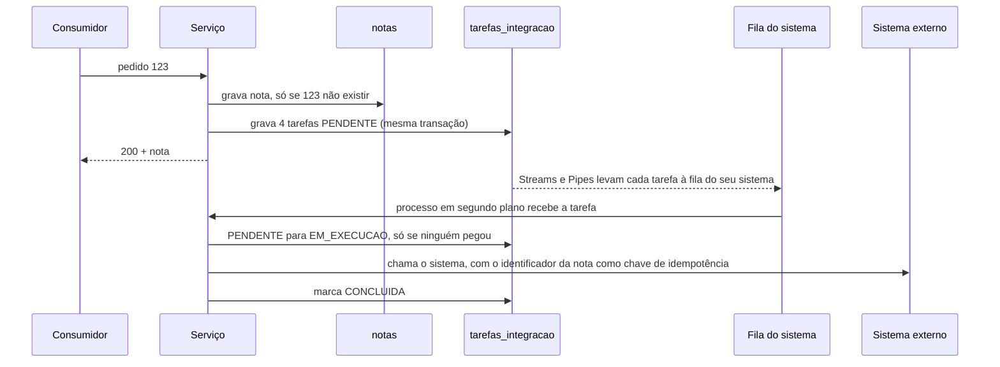

# Spike-0001: Onde guardar as notas e como garantir o acionamento dos quatro sistemas?

**Resposta:** DynamoDB com duas tabelas, `notas` e `tarefas_integracao`, gravadas na mesma transação. A tabela de tarefas é a fonte da verdade sobre o que falta enviar; as tarefas chegam a filas SQS, uma por sistema, por DynamoDB Streams e EventBridge Pipes, e uma rotina de reconciliação recoloca na fila o que ficou parado.

## Pergunta e critério
- **Pergunta:** qual banco e qual mecanismo atendem às decisões Q-09 a Q-13 do [levantamento](../../01-levantamento/levantamento-regras-negocio.md)?
- **Pronto quando:** cada requisito abaixo tem forma de ser atendido, com o caminho completo de um pedido e cada falha coberta.

## O que foi feito
Análise no papel, sem protótipo, comparando PostgreSQL (RDS), DynamoDB e MongoDB (DocumentDB ou Atlas) com os requisitos, seguida do desenho completo na opção escolhida. A validação prática fica para a fase 5.

Premissa: Registro, estoque, entrega e financeiro são sistemas externos, com as esperas simuladas mantidas. O Registro não é a persistência do serviço; os quatro são acionados depois da resposta, da mesma forma.

## O que aprendemos

### Requisitos
| # | Requisito | Origem |
|---|---|---|
| R1 | Gravar a nota e as tarefas de integração juntas, sem gravar uma sem a outra | Q-10, Q-11 |
| R2 | Achar a nota pelo `id_pedido` e impedir nota duplicada | Q-09, Q-12 |
| R3 | Apagar a nota após 5 anos | Q-13 |
| R4 | Saber o que está pendente ou falhou, e reprocessar só isso | Q-11 |
| R5 | Suportar a gravação como carga principal, sem volume conhecido | P-04 |
| R6 | Disponível em mais de uma zona, com pouca operação | RFC 6.3 |
| R7 | Consultas de auditoria não previstas | Q-13 |

### Comparação
| | PostgreSQL (RDS) | DynamoDB | MongoDB |
|---|---|---|---|
| R1 | Transação comum | Transação em até 100 itens, inclusive entre tabelas | Transação entre documentos |
| R2 | Chave única | Gravação condicional (só grava se a chave não existir) | Índice único |
| R3 | Rotina própria de expurgo | TTL nativo, sem custo | Índice TTL nativo |
| R4 | O serviço lê a tabela de pendentes | Índice só com os pendentes, mais filas | Change streams (avisa quando um dado muda) ou leitura periódica |
| R5 | Uma máquina para gravar; aguenta milhares por segundo, mas escalar é trocar de máquina | Escala sozinho, cobrado por uso | Escala por shards, que o time configura |
| R6 | Cópia de reserva; troca em falha leva 1 a 2 min | Replicado em várias zonas, sem troca | DocumentDB por instância; Atlas fora da conta AWS |
| R7 | SQL direto | Exportação para S3 e consulta pelo Athena | Consulta própria |
| Operação | Versões, conexões e janela de manutenção | Nenhum servidor | Instâncias (DocumentDB) ou outro fornecedor (Atlas) |

- **Por que DynamoDB:** atende R1 a R4 com recursos nativos e ganha em R5 e R6, que pesam num serviço cuja carga é quase só gravação. R7 fica atendido pela exportação, sem pesar no banco.
- **Por que não PostgreSQL:** atende tudo com menos componentes, mas a gravação depende de uma máquina só e a troca em falha deixa o serviço sem gravar por 1 a 2 minutos.
- **Por que não MongoDB:** o esquema flexível não ajuda, porque a nota tem estrutura fixa. Na AWS, custa instâncias como o RDS (DocumentDB, compatível só em parte) ou traz outro fornecedor com dados fora da conta (Atlas).

### Como fica no DynamoDB

**Tabelas**
| Tabela | Chave de partição | Chave de ordenação | Campos principais |
|---|---|---|---|
| `notas` | `id_pedido` | não tem | nota completa, `emitida_em`, `hash_pedido`, `client_id` de quem emitiu, `expira_em` |
| `tarefas_integracao` | `id_pedido` | `sistema` (REGISTRO, ESTOQUE, ENTREGA, FINANCEIRO) | `status` (PENDENTE, EM_EXECUCAO, CONCLUIDA, FALHOU), `tentativas`, `ultimo_erro`, `bloqueada_ate`, `fatia_pendente`, `pendente_desde`, `expira_em` |

- **`emitida_em`:** gerada pela aplicação no momento da gravação, no fuso de São Paulo. É a data da nota, a mesma devolvida no reenvio, e o campo que a auditoria filtra.
- **`expira_em`:** 1º de janeiro do ano seguinte à emissão + 5 anos, gravado como número em segundos (epoch, UTC), formato exigido pelo TTL. O TTL (expurgo automático) do DynamoDB apaga o item em até alguns dias depois dessa data. Premissa a confirmar com o Fiscal: o prazo de guarda conta a partir do exercício seguinte (CTN, art. 173).
- **`hash_pedido`:** calculado pela aplicação, não vem na requisição. O corpo do pedido é reescrito num formato fixo pela RFC 8785 (campos ordenados pelo código dos caracteres, números num formato único, sem espaços) e passa pelo SHA-256, que gera um código de 64 caracteres. Sem o formato fixo, o mesmo pedido com os campos em outra ordem geraria outro código. Guardar o código, e não o pedido inteiro, evita duplicar dado pessoal.
- **Chaves:** o `id_pedido` tem um valor diferente por pedido e espalha as gravações sozinho. As 4 tarefas de um pedido ficam juntas, então uma consulta mostra a situação completa dele.
- **Sem dado pessoal na tarefa nem na fila:** quem executa a tarefa lê a nota em `notas`.

**Índice de pendentes.** A tabela só se consulta pela própria chave: dá para pedir "tarefas do pedido 123", não "tarefas pendentes", e sem índice só resta ler a tabela inteira (Scan). Um índice secundário global (GSI) é uma segunda cópia da tabela, organizada por outra chave e mantida pelo DynamoDB a cada gravação, com atraso de fração de segundo. Ele é esparso: só entra no índice o item que tem o atributo usado como chave.

| id_pedido | sistema | status | fatia_pendente | pendente_desde |
|---|---|---|---|---|
| 123 | ESTOQUE | CONCLUIDA | *(removido)* | *(removido)* |
| 123 | ENTREGA | PENDENTE | PENDENTE#3 | 10:15 |
| 456 | ESTOQUE | EM_EXECUCAO | PENDENTE#7 | 10:16 |

O índice `pendentes` contém só as duas últimas linhas, com chave de partição `fatia_pendente` e de ordenação `pendente_desde`.
- **Entrada e saída:** a tarefa entra no índice ao ser criada e sai quando vira CONCLUIDA ou FALHOU, porque esses dois atributos são removidos. O índice fica pequeno.
- **Fatias (write sharding):** com uma chave única (`PENDENTE`), toda tarefa nova cairia na mesma partição, que aceita cerca de 1.000 gravações por segundo. A chave vira `PENDENTE#` + (número derivado do `id_pedido`, módulo 10), e as gravações se espalham por 10 partições. A consulta é feita uma vez por fatia e o resultado é juntado. É prática documentada pela AWS.

**Caminho do pedido 123**

- **Transporte:** o Streams publica cada alteração da tabela; um Pipe por sistema filtra só as inserções (`eventName = INSERT`) daquele sistema e as coloca na fila dele. Sem o filtro de inserção, cada mudança de status viraria uma mensagem nova, em laço. Filas separadas impedem que a entrega lenta atrase os outros.
- **Execução única:** o processo pega a tarefa com uma gravação condicional, "EM_EXECUCAO, só se hoje for PENDENTE, ou EM_EXECUCAO com `bloqueada_ate` vencido". O DynamoDB confere a condição e grava num único passo, uma alteração por vez no mesmo item: se duas tarefas do ECS recebem a mesma mensagem, só a primeira passa. A outra não apaga a mensagem enquanto a tarefa estiver EM_EXECUCAO, porque a cópia repetida é a mesma mensagem, e apagá-la tiraria a nova tentativa de quem está executando; ela só apaga se a tarefa já estiver CONCLUIDA ou FALHOU. O `bloqueada_ate` (agora + 60 s) libera a tarefa se quem a pegou cair no meio.
- **Reenvio:** a gravação condicional em `notas` falha, o serviço lê a nota (ou a recebe na própria recusa, com `ReturnValuesOnConditionCheckFailure`) e compara o `hash_pedido`. Em envios simultâneos, a recusa pode vir como conflito de transação (`TransactionConflict`); nesse caso, uma nova tentativa curta leva ao mesmo caminho. Conteúdo igual devolve a mesma nota sem criar tarefas; diferente é recusado. Dois envios simultâneos também caem aqui, porque só um grava.
- **Nova tentativa:** a tarefa volta a PENDENTE com `tentativas` + 1, e a mensagem, que não foi apagada, reaparece quando vence a visibilidade da fila (2 minutos). Na 5ª falha, cerca de 10 minutos depois, o serviço marca a tarefa como FALHOU e move a mensagem para a fila de erro (DLQ), e o alarme avisa a operação no mesmo dia. O serviço faz esse movimento porque o SQS conta recebimentos, não falhas; o limite de recebimentos da fila (10) fica só como rede de segurança.
- **Reconciliação:** conferência entre o que deveria ter acontecido e o que aconteceu. A cada poucos minutos, uma rotina agendada no próprio serviço consulta o índice e recoloca na fila as tarefas abertas há mais de 15 minutos, prazo maior que a janela de tentativas. O caminho normal é empurrado pelo Streams em segundos; a reconciliação só pega exceções, por isso não precisa rodar com frequência.
- **Reprocessar só a etapa:** voltar a tarefa FALHOU para PENDENTE e reenviar a mensagem da DLQ. A DLQ guarda a mensagem por 14 dias, contados do envio original; o tratamento precisa acontecer dentro desse prazo.

### Falhas e como cada uma é coberta
| Falha | O que acontece |
|---|---|
| Serviço cai antes da transação | Nada é gravado; o cliente recebe erro e reenvia normalmente |
| Serviço cai depois da transação, antes da resposta | O cliente reenvia e recebe a mesma nota; as tarefas já seguem |
| Evento do Streams perdido, ou Pipe fora do ar | A reconciliação recoloca a tarefa na fila |
| Sistema externo fora do ar | Novas tentativas; depois DLQ e alarme |
| Processo cai com a tarefa EM_EXECUCAO | O `bloqueada_ate` vence e a mensagem, que não foi apagada, volta a outro processo |
| Chamada externa deu certo, mas marcar CONCLUIDA falhou | A mensagem volta e a chamada se repete; o sistema externo descarta pela chave de idempotência (T-03 da [RFC](../rfc/0001-modernizacao-gerador-nota-fiscal.md)) |
| Mensagem entregue duas vezes | A gravação condicional deixa só um processo executar; quem perde não apaga a mensagem |
| DynamoDB indisponível | O cliente recebe 503 e nada é gravado |

### Armadilhas e o que não deu para medir
- **Limite de 400 KB por item:** estimando cerca de 150 bytes por linha de item, uma nota passa do limite por volta de 2.500 linhas. A estimativa não foi medida, e o máximo de linhas por pedido não é conhecido.
- **Partição quente no índice:** resolvida pelas fatias; o número de fatias é revisto com o volume real (T-04 da RFC).
- **Streams guarda os eventos só por 24 horas:** o Pipe os move para o SQS, que guarda até 14 dias, e a reconciliação cobre o resto.
- **SQS entrega pelo menos uma vez:** a mesma mensagem pode chegar mais de uma vez; a execução única e a chave de idempotência cobrem.
- **SQS conta recebimentos, não falhas:** por isso o serviço move a mensagem para a DLQ ao marcar FALHOU.
- **Pool HTTP do SDK:** o cliente do DynamoDB e do SQS usa um pool de conexões HTTP (50 por padrão), que precisa ser dimensionado junto com as virtual threads.
- **Normalização do hash:** a RFC 8785 pede uma biblioteca nova, a aprovar na spec.
- **O índice é atualizado com pequeno atraso:** não afeta a reconciliação, que olha tarefas paradas há minutos.
- **Transação custa o dobro de capacidade** de uma gravação simples.
- **Ambiente local:** DynamoDB Local (emulador oficial da AWS) e ElasticMQ (compatível com SQS) rodam em container, sem cadastro. O Pipe não tem emulador gratuito: o LocalStack passou a exigir conta e token em 2026. Localmente, o processamento é testado a partir da fila, que a reconciliação alimenta pelo mesmo caminho; o Pipe é validado no ambiente AWS de demonstração (fase 7).

## Decorrência
- ADR-0012 (banco) e ADR-0013 (acionamento das integrações).
- Q-10 do levantamento ajustada: o Registro passa a ser acionado depois da resposta, como os outros três.
- RFC: seções 6.1, 6.2 e 6.3.

Fontes: [DynamoDB: write sharding](https://docs.aws.amazon.com/amazondynamodb/latest/developerguide/bp-partition-key-sharding.html) · [LocalStack: mudanças de 2026](https://blog.localstack.cloud/2026-upcoming-pricing-changes/)
